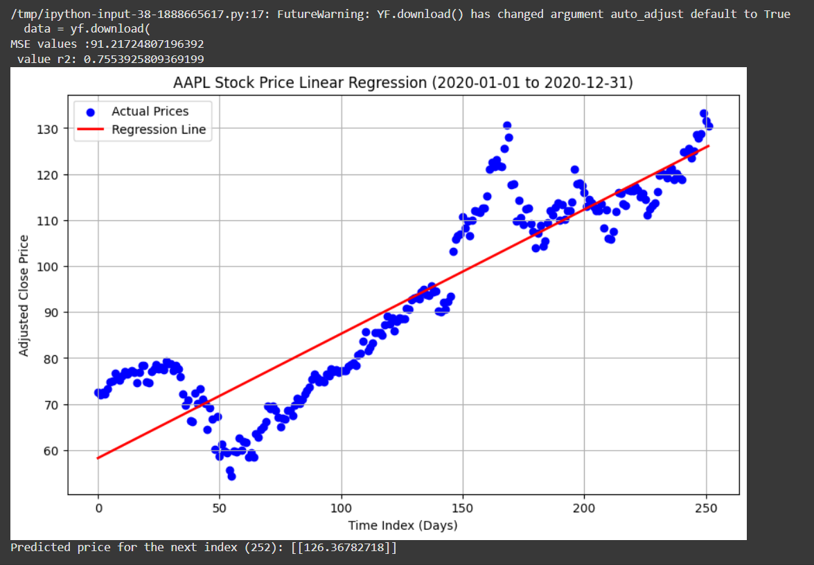

# Simple-Linear-regression-for-stock-prices

Just a simple linear regression model used to predict the stock price of a given ticker , for a given period or date interval. 

## Metrics for evaluations : 
i only use R^2 and MSE for evaluation , feel free to add others if you wish to use my code 

### this code was made entirely by a human and no ai was involved(its kind of obvious when you look at it...)

